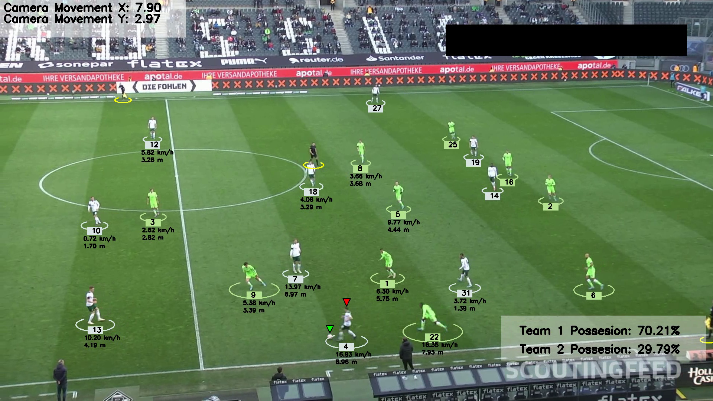

# Football Analysis Project

## Introduction

The goal of this project is to detect and track players, referees, and ball in a video using YOLO, a state-of-the-art AI object detection model. 
The project involves training YOLO to enhance its performance and using K-means clustering for pixel segmentation to assign players to teams based on their t-shirt colors. 
This information is crucial for measuring a team's ball acquisition percentage during a match.

In addition, optical flow is used to assess camera movement between frames, which is needed to accurately measure player movements. 
Perspective transformation is applied to represent the scene's depth and perspective, allowing for measurements of player movements in meters rather than just pixels.
Finally, the project includes calculations for players' speeds and distances covered. 

## Screenshot



## Modules Used

This project utilizes the following modules:

- **YOLO**: AI object detection model for detecting and tracking objects.
- **K-means**: Pixel segmentation and clustering for detecting t-shirt colors.
- **Optical Flow**: Measures camera movement between frames.
- **Perspective Transformation**: Represents scene depth and perspective.
- **Speed and Distance Calculation**: Calculates player speed and distance covered.

## Pre-trained Model

Due to the large size of the trained model, it is not included in the repository. You can download the trained model from the following link:

- [Download the trained model](https://github.com/DomagojPlanjar/football_analysis/releases/download/v1.0/best.pt)

### Instructions

1. Download the model from the link above.
2. Place the model file in the appropriate directory as specified in the usage instructions.
3. Follow the instructions in the documentation to use the model.


## Sample Video

[Sample Input Video](https://drive.google.com/file/d/1t6agoqggZKx6thamUuPAIdN_1zR9v9S_/view)

## Requirements

To run this project, ensure you have the following Python packages installed:

- Python 3.x
- `ultralytics`
- `supervision`
- `opencv-python`
- `numpy`
- `matplotlib`
- `pandas`

You can install the required packages using the provided `requirements.txt` file:

```bash
pip install -r requirements.txt

## Instructions

1. Download the model from the link above if you want to skip training phase.
2. Place the model file in the models directory.
3. Place the sample video in input_videos directory
4. Run main.py
5. Any additional help can be found as comments in files.
6. Additional videos to test the project can be found [here](https://www.kaggle.com/datasets/saberghaderi/-dfl-bundesliga-460-mp4-videos-in-30sec-csv/data),
just download any and place in input_videos directory. Make sure to set reading from stub in main.py to False when trying new videos as instructed.
